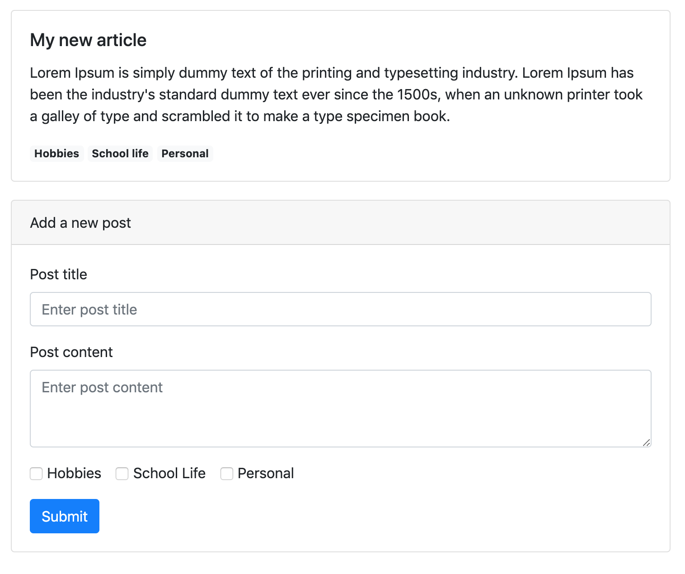

# Weekend project 1 (04/07/20)

## Here's your weekend challenge : create the javascript needed to make this blog work!

All right! With all that we've learn this week, we should be able to create something cool.

In this HTML file, we got a list of blog posts, and a form to create a new one. But right now, our form doesn't create anything! I need you to hook this form up, so it can function correctly.

After completing the form with the proper post title, content, and tags, we will click the submit button. After that, a new post should appear on the list, between the first one and the form itself.

A few tips :

-   The list to add the new post is identified with the id of **post-list**.
-   Study the HTML structure of a Post, you'll have to recreate it on javascript before inserting it into the DOM (don't forget to add the classes!)
-   Don't forget to reset the form after the submission
-   Divide the problem into smaller problems, and solve them one at a time
-   Code your solution into the script.js file

_Also... don't judge too harshly the poor html structure, it was made quickly with a library called bootstrap, I'll do better next time_ 😜

Happy coding ✨
